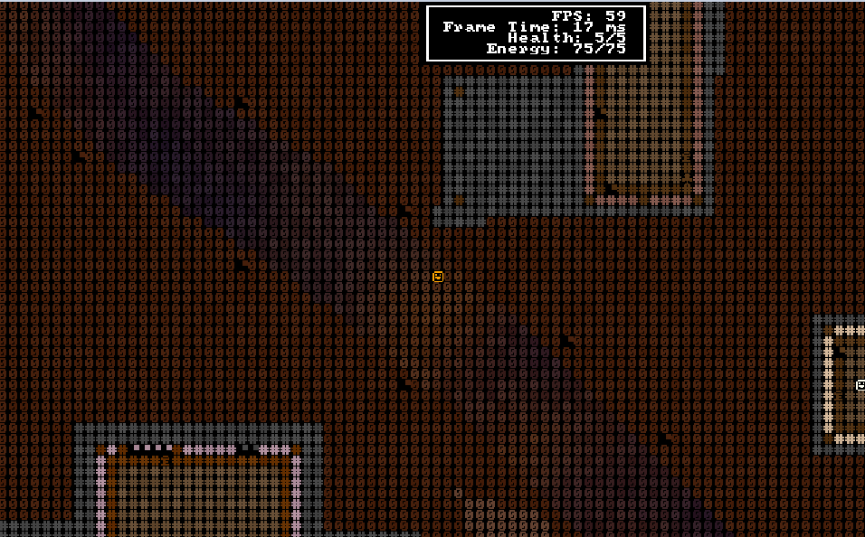

# velobracket ('veloren' + 'bracket-lib')

velobracket is Dwarf Fortress inspired frontend to Veloren, the multiplayer RPG voxel game written in Rust.

 

## Usage

Start velobracket using the following arguments:

```
velobracket --username YOUR_LOGIN --password YOUR_PASSWORD --character YOUR_CHARACTER
```

Optionally, you may also specify `--server` and `--port` arguments to play on something other than the main public server.

## Status

Currently implemented

- Basic World rendering
- Basic Object rendering
- Basic movement

To be implemented

- Tile based rendering
- Basic HUD
- Combat 
- Inventory management
- Accepting a group invite
- Chat
- Build mode
- Lighting
- Who's near you
- Picking up objects

## Tested on
 - Windows
 - macOS
 - Ubuntu

 ## Useful Links
 - https://book.veloren.net/contributors/developers/index.html
 - https://docs.veloren.net/veloren_common/
 - https://github.com/amethyst/bracket-lib

 ## Projects of common interest
 - https://github.com/zesterer/teloren